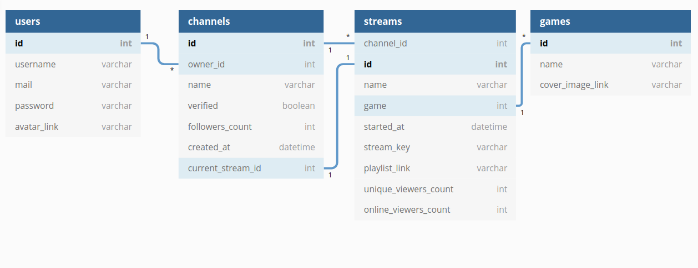

# Highload_2020_2_twitch.tv
Расчётно-пояснительная записка для twitch.tv

### Содержание:
1.  [Выбор темы](#1--выбор-темы)
2.  [Определение возможного диапазона нагрузок подобного проекта](#2-определение-возможного-диапазона-нагрузок-подобного-проекта)
3.  [Выбор планируемой нагрузки](#3-выбор-планируемой-нагрузки)
4.  Логическая схема базы данных (без выбора СУБД)
5.  Физическая системы хранения (конкретные СУБД, шардинг, расчет нагрузки, обоснование реализуемости на основе результатов нагрузочного тестирования)
6.  Выбор прочих технологий: языки программирования, фреймфорки, протоколы взаимодействия, веб-сервера и т.д. (с обоcнованием выбора)
7.  Расчет нагрузки и потребного оборудования
8.  Выбор хостинга / облачного провайдера и расположения серверов
9.  Схема балансировки нагрузки (входящего трафика и внутрипроектного, терминация SSL)
10.  Обеспечение отказоустойчивости

### 1.  Выбор темы
Стриминг видео на twitch.tv

### 2. Определение возможного диапазона нагрузок подобного проекта

По данным [[1]](https://twitchtracker.com/statistics) на 07.10.2020 было известно следующее:
|     | Одновременных зрителей, млн | Одновременных стримов, тыс. | Суммарное время просмотра в день, млн ч. |
|-----|------------------------------|------------------------------|------------------------------------------|
| min | 1.2                          | 40                           | 51                                       |
| max | 3.5                          | 140                          | 57                                       |

Скорость загрузки видео клиентом (измерено)
| Качество | FPS | Скорость, Мбит/с | Предполагаемое распределение, % |
|----------|-----|------------------|---------------------------------|
| 1080     | 60  | 8.2              | 24                              |
| 720      | 60  | 3.4              | 27                              |
| 720      | 30  | 2.4              | 22                              |
| 480      | 30  | 1.5              | 15                              |
| 360      | 30  | 0.77             | 9                               |
| 160      | 30  | 0.33             | 3                               |

Т.о.,  
Средняя скорость скачивания видео клиентом =  8.2\*0.24 + 3.4\*0.27 + 2.4\*0.22 + 1.5\*0.15 + 0.77\*0.09 + 0.33\*0.03 = **3.72 Мбит/с**  
**Минимальная** скорость скачивания видео **клиентами** = 3.72 Мбит/с \* 1.2 млн = **4464 Гбит/с**  
**Пиковая** скорость скачивания видео **клиентами** = 3.72 Мбит/с \* 3.5 млн = **13020 Гбит/с**  
 
 Скорость загрузки видео стримерами [[2]](https://stream.twitch.tv/encoding/)
| Качество | FPS | Скорость, Мбит/с | Предполагаемое распределение, % |
|----------|-----|------------------|---------------------------------|
| 1080     | 60  | 6.0              | 20                              |
| 1080     | 30  | 4.5              | 25                              |
| 720      | 60  | 4.5              | 20                              |
| 720      | 30  | 3.0              | 35                              |

Т.о.  
Средняя скорость загрузки видео стримером = 6.0\*0.20 + 4.5\*0.25 + 4.5\*0.20 + 3.0\*0.35 = **4.3 Мбит/с**  
**Минимальная** скорость загрузки видео **стримером** = 4.3 Мбит/с \* 40 тыс. = **172 Гбит/с**  
**Пиковая** скорость загрузки видео **стримером** = 4.3 Мбит/с \* 140 тыс. = **602 Гбит/с**  

### 3. Выбор планируемой нагрузки
Аналогичная twitch.tv

### 4. Логическая схема базы данных (без выбора СУБД)
  

### 5. Физическая системы хранения (конкретные СУБД, шардинг, расчет нагрузки, обоснование реализуемости на основе результатов нагрузочного тестирования)
#### Расчёт нагрузки и выбор СУБД
Нагрузка на БД будет состоять из нескольких частей:
- Получение данных о стриме, когда пользователь его включает (один раз):  
Самый большой прирост зрителей на 3.10.2020 за 10 минут составляет приблизительно 80тыс.[[3]](https://twitchtracker.com/statistics)  
Т.о. **пиковое** количество запросов за информацией о стриме от людей, включающих стрим = 80000 / (10\*60) = 133 rps

- В случае онлайн трансляции будет также получение информации о нынешнем количестве пользователей. Данная информация не является критической и может кэшироваться, например, на 1 минуту.  
Наибольшее количество стримов одновременно = 185тыс. [[4]](https://twitchtracker.com/statistics)  
Т.о запросов в базу за количеством пользователей = 185000 / 60 = 3083rps  

- Проверка stream-key для определения того, куда перенаправить видеопоток стримера. Получение stream-key будет производиться только один раз при начале трансляции.  
Наибольший прирост стримов за 10 минут на 21.10.2020 = 7тыс. [[5]](https://twitchtracker.com/statistics)  
Т.о. запрсов в базу за валидацией stream-key = 7000 / (10\*60) = 12rps  

### 6. Выбор прочих технологий: языки программирования, фреймфорки, протоколы взаимодействия, веб-сервера и т.д. (с обоcнованием выбора)

#### Бэкенд
Go (хорошая утилизация ресурсов сервера)  
Протоколу HLS Отдача стримов(поддержка автоматической смены качества, нативная поддержка браузерами и некоторыми другими устройствами (например, теми, которые используют chromecast))  
Nginx - отдачи кусочков стрима c серверов статики  
AWS Elemental MediaLive для преобразования RTMP потока в HLS потоки разного качества и с различным FPS  

#### Web клиент (зритель)
Javascript

#### Клиент стримера:  
Передача стримов по протоколу RTMP (большая поддержка протокола, так как ему уже 100 лет в обед)  
Передачу данных по этому протоколу поддерживает множество приложений для стримов, наиболее популярным из которых является OBS  
