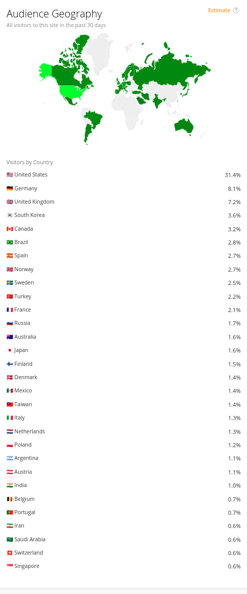
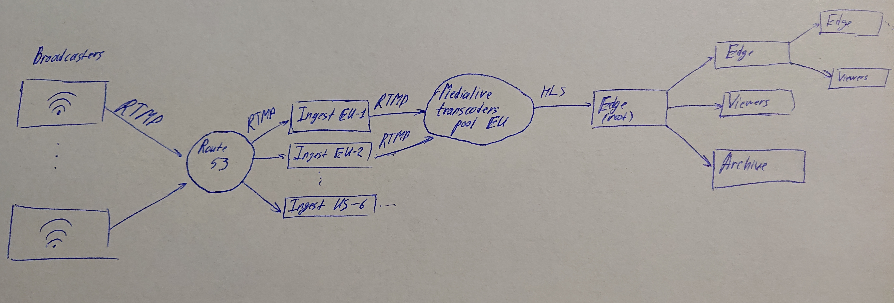
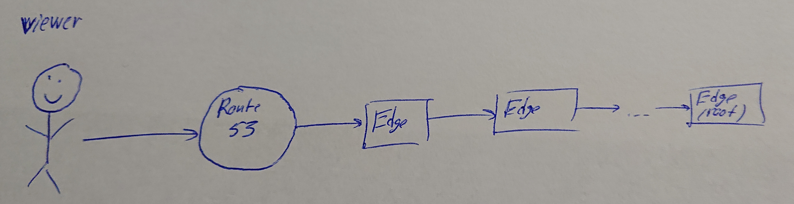
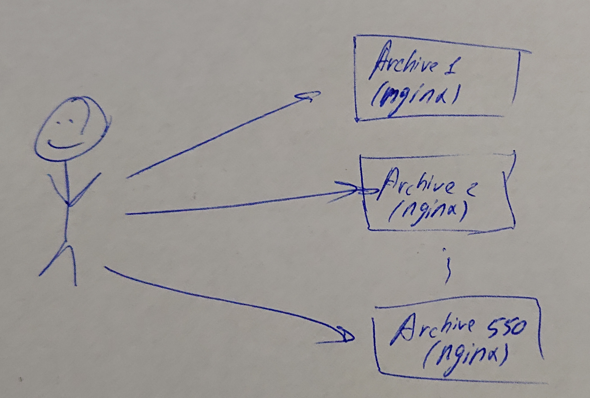

# Highload_2020_2_twitch.tv
Расчётно-пояснительная записка для twitch.tv

## Содержание:
1.  [Выбор темы](#1--выбор-темы)
2.  [Определение возможного диапазона нагрузок подобного проекта](#2-определение-возможного-диапазона-нагрузок-подобного-проекта)
3.  [Выбор планируемой нагрузки](#3-выбор-планируемой-нагрузки)
4.  [Логическая схема базы данных (без выбора СУБД)](#4-логическая-схема-базы-данных-без-выбора-субд)
5.  [Физическая системы хранения (конкретные СУБД, шардинг, расчет нагрузки, обоснование реализуемости на основе результатов нагрузочного тестирования)](#5-физическая-системы-хранения-конкретные-субд-шардинг-расчет-нагрузки-обоснование-реализуемости-на-основе-результатов-нагрузочного-тестирования)
6.  [Выбор прочих технологий: языки программирования, фреймфорки, протоколы взаимодействия, веб-сервера и т.д. (с обоcнованием выбора)](#6-выбор-прочих-технологий-языки-программирования-фреймфорки-протоколы-взаимодействия-веб-сервера-и-тд-с-обоcнованием-выбора)
7.  [Расчет нагрузки и потребного оборудования](#7-расчет-нагрузки-и-потребного-оборудования)
8.  [Выбор хостинга / облачного провайдера и расположения серверов](#8-выбор-хостинга--облачного-провайдера-и-расположения-серверов)
9.  [Схема балансировки нагрузки (входящего трафика и внутрипроектного, терминация SSL)](#9-схема-балансировки-нагрузки-входящего-трафика-и-внутрипроектного-терминация-ssl)
10. [Обеспечение отказоустойчивости](#10-обеспечение-отказоустойчивости)

## 1.  Выбор темы
Стриминг видео на twitch.tv

## 2. Определение возможного диапазона нагрузок подобного проекта

По данным [[1]](https://twitchtracker.com/statistics) на 07.10.2020 было известно следующее:
|     | Одновременных зрителей, млн | Одновременных стримов, тыс. | Суммарное время просмотра в день, млн ч. |
|-----|------------------------------|----------------------------|------------------------------------------|
| min | 1.2                          | 40                         | 51                                       |
| max | 3.5                          | 185                        | 57                                       |

### Зритель

Скорость загрузки видео зрителем  
| Качество | FPS | Скорость, МБ/с   | Предполагаемое распределение, % |
|----------|-----|------------------|---------------------------------|
| 1080     | 60  | 0.75             | 24                              |
| 720      | 60  | 0,56             | 27                              |
| 720      | 30  | 0,28             | 22                              |
| 480      | 30  | 0,19             | 15                              |
| 360      | 30  | 0,09             | 9                               |
| 160      | 30  | 0,035            | 3                               |

Т.о.,  
Средняя скорость скачивания видео зрителем =  0,75\*0.24 + 0,56\*0.27 + 0,28\*0.22 + 0,19\*0.15 + 0,09\*0.09 + 0,035\*0.03 = **0,43 МБ/с**  
**Минимальная** скорость скачивания видео **зрителями** = 0,43 МБ/с \* 1.2 млн = **4128 Гбит/с**  
**Пиковая** скорость скачивания видео **зрителями** = 3.72 Мбит/с \* 3.5 млн = **12040 Гбит/с**  

### Стример

Скорость загрузки видео стримерами [[2]](https://stream.twitch.tv/encoding/)  
| Качество | FPS | Скорость, Мбит/с | Предполагаемое распределение, % |
|----------|-----|------------------|---------------------------------|
| 1080     | 60  | 0,75             | 20                              |
| 1080     | 30  | 0,56             | 25                              |
| 720      | 60  | 0,56             | 20                              |
| 720      | 30  | 0,28             | 35                              |

Т.о.  
Средняя скорость загрузки видео стримером = 0,75\*0.20 + 0,56\*0.25 + 0,56\*0.20 + 0,28\*0.35 = **0,5 МБ/с**  
**Минимальная** скорость загрузки видео **стримерами** = 0,5 МБ/с \* 40 тыс. = **160 Гбит/с**  
**Пиковая** скорость загрузки видео **стримерами** = 0,5 МБ/с \* 185 тыс. = **736 Гбит/с**  

### Транскодер

Скорость выдачи транскодером видео
| Качество | FPS | Скорость выходного потока, МБ/с |
|----------|-----|---------------------------------|
| 1080     | 60  | 1.85                            |
| 1080     | 30  | 1.1                             |
| 720      | 60  | 1.1                             |
| 720      | 30  | 0.595                           |

Т.о.  
Средняя скорость выходного потока транскодера = 1.85\*0.20 + 1.1\*0.25 + 1.1\*0.20 + 0.595\*0.35 = **1,07 МБ/с**  
**Минимальная** скорость выходного потока = 1,07 МБ/с \* 40 тыс. = **344 Гбит/с**  
**Пиковая** скорость выходного потока = 1,07 МБ/с \* 185 тыс. = **1600 Гбит/с**  

## 3. Выбор планируемой нагрузки
Аналогичная twitch.tv

## 4. Логическая схема базы данных (без выбора СУБД)
  

## 5. Физическая системы хранения (конкретные СУБД, шардинг, расчет нагрузки, обоснование реализуемости на основе результатов нагрузочного тестирования)
### Расчёт нагрузки и выбор СУБД
Нагрузка на БД будет состоять из нескольких частей:

- (FRONTEND) Получение информации о пользователе при входе на сайт.  
Самый большой прирост зрителей на сайте составляет 170тыс. за 10 минут.    
Т.о запросов в базу за информацией о пользователе = 170000 / 60 = **283 rps**  
Для кэширования информации о количестве зрителей можно использовать Memcached, а сами счётчики хранить в PostgreSql  

- (FRONTEND) Получение данных о стриме, когда пользователь его включает (один раз):  
Самый большой прирост зрителей на 3.10.2020 за 10 минут составляет приблизительно 80тыс.[[3]](https://twitchtracker.com/statistics)  
Т.о. **пиковое** количество запросов за информацией о стриме от людей, включающих стрим = 80000 / (10\*60) = **133 rps**  
Для этого вполне подойдёт PostgreSql  

- (FRONTEND) В случае онлайн трансляции будет также получение информации о нынешнем количестве пользователей. Данная информация не является критической и может кэшироваться, например, на 1 минуту.  
Наибольшее количество стримов одновременно = 185тыс. [[4]](https://twitchtracker.com/statistics)  
Т.о запросов в базу за количеством пользователей = 185000 / 60 = **3083 rps**  
Для кэширования информации о количестве зрителей можно использовать Memcached, а сами счётчики хранить в PostgreSql  

- (INGEST SERVERS) Проверка stream-key для определения того, куда перенаправить видеопоток стримера. Получение stream-key будет производиться только один раз при начале трансляции.  
Наибольший прирост стримов за 10 минут на 21.10.2020 = 7тыс. [[5]](https://twitchtracker.com/statistics)  
Т.о. запрсов в базу за валидацией stream-key = 7000 / (10\*60) = **12 rps**  
Для этого вполне подойдёт PostgreSql  

Итого:  
запросов в Postgresql - **428** rps  
запросов в Memcahced - **3083** rps  

### Расчёт объёма данных в СУБД  

#### PostgreSQL  
- users  
Одна запись в таблице users = id(8) + username(25) + mail(64) + password(32) + avatar_link(64) + 
verified(1) + followers_count(8) + created_at(8) + current_stream_id(8) + stream_key(64) = 282 Б  
Зная, что максимальное количество уникальных зрителей в месяц равно 140млн [[6]](https://www.businessofapps.com/data/twitch-statistics/), можно принять, что всего записей будет порядка 200 млн  
Т.о. вес таблицы users = 282 \* 200e6 = 564e8 Б = **56.4 ГБ**  

- streams
Одна запись в таблице streams = channel_id(8) + id(8) + name(64) + started_at(8) + master_playlist(128) + unique_viewers_count(8) + online_viewers_count(8) = 232 Б  
Зная, что каждый день максимальное количество стримов варьируется от 70тыс. до 185тыс., можно предположить, что каждый день проходит порядка 200-250тыс. стримов. Примем, что каждый день проходит *250тыс.* стримов.  
Также примем, что 70% из них сохраняется в архив на 14 дней.  
Т.о. вес таблицы streams = 232 \* 250e3 \* 14 = 812e6 Б = **0.812 ГБ**  

- transcoders_links  
Одна запись в таблице transcoders_links = stream_key(64) + transcoder_link(64) = 128 Б  
Для одного стрима выделяется один канал транскодер, то в таблице будет максимум, т.е. одна зщапись в таблице.  
Наибольшее количество стримов одновременно = 185тыс.  
Т.о. вес таблицы transcoders_links = 128 \* 185e3 \* 14 = 812e6 Б = **23,7 МБ**  

#### Memcached
- Как уже былдо сказано, наибольшее количество стримов одновременно = 185тыс  
Т.о., придётся хранить id стрима (8 байт) и количество зрителей онлайн (8 байт), т.е. 16 байт на запись  
Т.о., все счётчики будут занимать в памяти: 8 \* 185e3 = 1,48 МБ

### Расчёт объёма данных в архивах

Всего в месяц стримится порядка 75млн (в неделю ~ 19 млн. ч.). часов видео. Допустим, что **70% контента сохраняется на неделю**.  

| Качество | FPS | Вес часа стрима, ГБ | Всего часов в неделю в таком качестве, млн. ч | Всего места занимает, ПБ | Место с учётом процента хранимых стримов, ПБ |
|----------|-----|---------------------|-----------------------------------------------|--------------------------|----------------------------------------------|
| 1080     | 60  | 6.7                 | 3.8                                           | 25.5                     | 17.9                                         |
| 1080     | 30  | 4                   | 4.7                                           | 18.8                     | 13.2                                         |
| 720      | 60  | 4                   | 3.8                                           | 15.2                     | 10.7                                         |
| 720      | 30  | 2.1                 | 6.7                                           | 14.1                     | 9.87                                         |  

Отсюда следует, что для хранения архива нам понадобиться приблизительно 52ПБ места

Примем, что **30% зрителей смотрят записи из архива**. Тогда в пиковой нагрузке на сайте присутствует 3,5 млн. пользователей, а записи смотрит 1,05 млн.  
Отсюда следует, что пиковая скорость скачивания видео из архива: 1,05e6 \* 0.43МБ/с = 0,45e6МБ/с = **3600Гбит/с**  

## 6. Выбор прочих технологий: языки программирования, фреймфорки, протоколы взаимодействия, веб-сервера и т.д. (с обоcнованием выбора)

### Бэкенд
Go (хорошая утилизация ресурсов сервера)  
Nginx - отдачи кусочков стрима c серверов статики  
Отдача стримов(поддержка автоматической смены качества, нативная поддержка браузерами и некоторыми другими устройствами (например, теми, которые используют chromecast))  
AWS Elemental MediaLive для преобразования RTMP потока в HLS потоки разного качества и с различным FPS  

### Web клиент (зритель)
Javascript

### Клиент стримера:  
Передача стримов по протоколу RTMP  
Передачу данных по этому протоколу поддерживает множество приложений для стримов, наиболее популярным из которых является OBS  

## 7. Расчет нагрузки и потребного оборудования

### БД  
Как уже было сказано, для хранения информации о пользователях, стримах и доступных транскодерах нам потребуется \~60 ГБ свободного места. Мы также должны обеспечить для них репликацию мастер-слейв. Т.о. нам понадобиться 3 сервера по 57ГБ свободного места. Суммарная нагрузка на мастера ожидается порядка 450 rps.  

Для кэширования информации о количестве зрителей также отдельно будем использовать memcached, на который будет приходить порядка 3100 rps.  

Для хранения информации будем использовать **1 SSD по 240 ГБ в каждом сервере**

### Архив  
#### Память
Для хранения архива нам понадобится 52ПБ. Также будем хранить по 2 реплики на каждый сервер. Тогда нам понадобиться **156 ПБ**

#### Скорость записи в архив
Средняя скорость скачивания транскодированного видео = **1,07МБ/с**  
В пиковом случае загружаться видео в архив будут со скоростью  
185e3 \* 1,07 \* 0,7 = 138565 МБ/с = **1100 Гбит/с**,  
где 185e3 - пиковое количесвто одновременных стримов, 70% - процент сохраняемых стримов

#### Скорость отдачи видео из архива
Средняя скорость скачивания зрителем видео = **0,43 МБ/с**  
В пиковом случае скачиваться контент из архива будут со скоростью  
3.5e6 \* 0.43 \* 0.3 = 451500 МБ/с = **3600 Гбит/с**,  
где 3.5e6 - пиковое количесвто одновременных зрителей, 30% - процент зрителей, смотрящих записи стримов  

#### Требуемые ресурсы  
Из расчётов следует, что нам нужны столько серверов, чтобы обеспечить приём и выдачу данных со скоростью **4700 Гбит/с** и суммарным объёмом в 157 ПБ. Примем, что наибольшая скорость интернета для одного сервера **10 Гб/c**, тогда нам понадобится 470 серверов минимум. Возьмём для запаса **550** серверов (20% коэффициент запаса).  
В таком случае, каждый из них должен иметь объём 157 ПБ / 550 = **285 ТБ**.  
Установим в каждый из серверов **по 16 дисков на 20 Тб**

### Edge-сервера  
Через edge сервера будет производиться распространения live контента от транскодеров ко зрителям.  

#### Память
Edge-сервер будет хранить в себе последние 10 секунд стрима, что в среднем будет занимать **11 МБ** места  
Средняя скорость скачивания зрителем видео = **0,43 МБ/с**  
Максимальная скорость раздачи стриов зрителям - **10 Гбит/c**.  
Значит, что если мы будем раздавать каждому зрителю разные стримы, то мы сможем раздавать  
10 Гбит / 0.43 МБ =  1250МБ / 0,43МБ = **2900** разных стримов.  
Тогда нам придётся хранить на edge-сервере 2900 * 11 = 31900 МБ = 31ГБ контента.
Для хранения такого количества видео, понадобится **64GB RAM**.  

#### Получение видео с транскодера
Средняя скорость скачивания транскодированного видео = **1,07МБ/с**  
В пиковом случае загружаться видео в архив будут со скоростью  
185e3 \* 1,07 = 197950 МБ/с = **12000 Гбит/с**,  
где 185e3 - пиковое количесвто одновременных стримов  

#### Выдача видео зрителям
Средняя скорость скачивания зрителем видео = **0,43 МБ/с**  
В пиковом случае скачиваться контент из архива будут со скоростью  
3.5e6 \* 0.43 = 1500000 МБ/с = **3600 Гбит/с**,  
где 3.5e6 - пиковое количесвто одновременных зрителей  

#### Требуемые ресурсы  
Из расчётов следует, что нам нужны столько серверов, чтобы обеспечить приём и выдачу данных со скоростью **15600 Гбит/с**. Примем, что наибольшая скорость интернета для одного сервера **20 Гбит/c** (2 сетевые карты по 10Гбит/с), тогда нам понадобится 780 серверов минимум. Возьмём для запаса **900** серверов (20% коэффициент запаса).  
Установим в каждый из серверов **по 64GB RAM и 1 SSD на 120GB для системы**

### Итого  
| Роль  | CPU     | RAM    | SSD     | HDD     | Количество |
|-------|---------|--------|---------|---------|------------|
| БД    | 32 ядра | 128 Гб | 1x240GB | -       | 3          |
| Архив | 32 ядра | 256 Гб | -       | 16x20TB | 550        |
| Edge  | 64 ядра | 64 Гб  | 1x120GB | -       | 1900       |

## 8. Выбор хостинга / облачного провайдера и расположения серверов

В качестве хостинга будем использовать AWS.  
Для определения местоположения серверов, сначала определим распределение пользователей по миру.
По данным Alexa известно следующее распределение:  

Распределение по географии:  
- Северная Америка (35%):  
    - 32% - США  
    - 3% - канада
- Южная Америка (4%):  
    - 3% - Бразилия  
    - 1% - Аргентина
- Европа (37%):  
    - 8% - Германия  
    - 7% - Англия  
    ...
    - 2% - Россия  
- Страны западной азии (5%)  
- Страны восточной азии (5.6%):  
    - 4% - Южная корея  
    - 1.6% - Япония  
- Австралия (1,6%)  

Установим сервера с БД в США. Сервера для хранения архива и edge-сервера стоит распределить в зависимости от распределения пользователей (т.е 35% серверов будет находиться в Северной Америке и т.д.)

## 9. Схема балансировки нагрузки (входящего трафика и внутрипроектного, терминация SSL)

### Входящий стрим  
Стрим через geo-based балансировку (route 53) направляется на ingest сервер, задачей которого является проверка ключа для стрима, редирект стрима в подходящий сервер-транскодер или его создание, если свободных транскодеров нет. После транскодирование полученный HLS поток направляется на какой-либо Edge-сервер (который будем называть корневым edge-сервером для данного стрима), который направляет поток в архив и, в случае необходимости, зрителям и следующему edge-серверу. Передача потоку следующем edge-серверу нужна в случае, если пропускная способность данного edge-сервера подходит к концу.

### Лайв стрим  
Зритель с помощью route 53 находит ближайший edge, с которго начинает смотреть стрим. Если стрим туда не передавался, то этот edge-сервер получает этот стрим от другого edge-сервера и так пока не дойдёт до корневого edge-сервера данного стрима.

### Архивированный стрим  
Для получения архивированного стрима, пользователю требуется сначала получить плейлист, в котором будут прописаны пути до каждого кусочка HLS стрима, что позволяет хранить записи стрима на разных серверах. На каждом сервере архива стоит nginx для отдачи статики с дисков

## 10. Обеспечение отказоустойчивости
Для обечпечения отказоустойчивости БД мы используем мастер-слейв репликацию.  

Для обечпечания отказоучтойчивости архива также используется репликация (видеозаписи хранятся на 3 серверах). Для большей отказоустойчивости, эти сервера можно разнести в разные ДЦ чтобы не было потери всех дынных в случае потери одного из ДЦ.  

Для обеспечения отказоустойчивости лайвстримов можно было бы HLS поток с транскодера высылать не на один, а на 2 разных edge-сервера. Чтобы в случае отказа одного из них не было прерывания лайвстрима.

Также есть смысл ввести мониторинг за основными показателями серверов для быстрого выявления аномальных ситуаций и их исправления.
