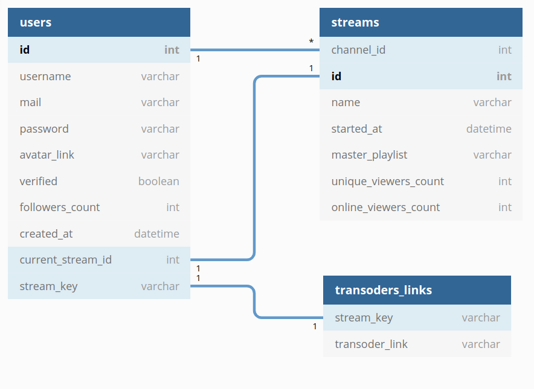

# Highload_2020_2_twitch.tv
Расчётно-пояснительная записка для twitch.tv

### Содержание:
1.  [Выбор темы](#1--выбор-темы)
2.  [Определение возможного диапазона нагрузок подобного проекта](#2-определение-возможного-диапазона-нагрузок-подобного-проекта)
3.  [Выбор планируемой нагрузки](#3-выбор-планируемой-нагрузки)
4.  Логическая схема базы данных (без выбора СУБД)
5.  Физическая системы хранения (конкретные СУБД, шардинг, расчет нагрузки, обоснование реализуемости на основе результатов нагрузочного тестирования)
6.  Выбор прочих технологий: языки программирования, фреймфорки, протоколы взаимодействия, веб-сервера и т.д. (с обоcнованием выбора)
7.  Расчет нагрузки и потребного оборудования
8.  Выбор хостинга / облачного провайдера и расположения серверов
9.  Схема балансировки нагрузки (входящего трафика и внутрипроектного, терминация SSL)
10.  Обеспечение отказоустойчивости

### 1.  Выбор темы
Стриминг видео на twitch.tv

### 2. Определение возможного диапазона нагрузок подобного проекта

По данным [[1]](https://twitchtracker.com/statistics) на 07.10.2020 было известно следующее:
|     | Одновременных зрителей, млн | Одновременных стримов, тыс. | Суммарное время просмотра в день, млн ч. |
|-----|------------------------------|------------------------------|------------------------------------------|
| min | 1.2                          | 40                           | 51                                       |
| max | 3.5                          | 140                          | 57                                       |

Скорость загрузки видео клиентом (измерено)
| Качество | FPS | Скорость, Мбит/с | Предполагаемое распределение, % |
|----------|-----|------------------|---------------------------------|
| 1080     | 60  | 8.2              | 24                              |
| 720      | 60  | 3.4              | 27                              |
| 720      | 30  | 2.4              | 22                              |
| 480      | 30  | 1.5              | 15                              |
| 360      | 30  | 0.77             | 9                               |
| 160      | 30  | 0.33             | 3                               |

Т.о.,  
Средняя скорость скачивания видео клиентом =  8.2\*0.24 + 3.4\*0.27 + 2.4\*0.22 + 1.5\*0.15 + 0.77\*0.09 + 0.33\*0.03 = **3.72 Мбит/с**  
**Минимальная** скорость скачивания видео **клиентами** = 3.72 Мбит/с \* 1.2 млн = **4464 Гбит/с**  
**Пиковая** скорость скачивания видео **клиентами** = 3.72 Мбит/с \* 3.5 млн = **13020 Гбит/с**  
 
 Скорость загрузки видео стримерами [[2]](https://stream.twitch.tv/encoding/)
| Качество | FPS | Скорость, Мбит/с | Предполагаемое распределение, % |
|----------|-----|------------------|---------------------------------|
| 1080     | 60  | 6.0              | 20                              |
| 1080     | 30  | 4.5              | 25                              |
| 720      | 60  | 4.5              | 20                              |
| 720      | 30  | 3.0              | 35                              |

Т.о.  
Средняя скорость загрузки видео стримером = 6.0\*0.20 + 4.5\*0.25 + 4.5\*0.20 + 3.0\*0.35 = **4.3 Мбит/с**  
**Минимальная** скорость загрузки видео **стримером** = 4.3 Мбит/с \* 40 тыс. = **172 Гбит/с**  
**Пиковая** скорость загрузки видео **стримером** = 4.3 Мбит/с \* 140 тыс. = **602 Гбит/с**  

### 3. Выбор планируемой нагрузки
Аналогичная twitch.tv

### 4. Логическая схема базы данных (без выбора СУБД)
  

### 5. Физическая системы хранения (конкретные СУБД, шардинг, расчет нагрузки, обоснование реализуемости на основе результатов нагрузочного тестирования)
#### Расчёт нагрузки и выбор СУБД
Нагрузка на БД будет состоять из нескольких частей:
- (FRONTEND) Получение данных о стриме, когда пользователь его включает (один раз):  
Самый большой прирост зрителей на 3.10.2020 за 10 минут составляет приблизительно 80тыс.[[3]](https://twitchtracker.com/statistics)  
Т.о. **пиковое** количество запросов за информацией о стриме от людей, включающих стрим = 80000 / (10\*60) = 133 rps  
Для этого вполне подойдёт PostgreSql  

- (FRONTEND) В случае онлайн трансляции будет также получение информации о нынешнем количестве пользователей. Данная информация не является критической и может кэшироваться, например, на 1 минуту.  
Наибольшее количество стримов одновременно = 185тыс. [[4]](https://twitchtracker.com/statistics)  
Т.о запросов в базу за количеством пользователей = 185000 / 60 = 3083rps  
Для кэширования информации о количестве зрителей можно использовать Memcached, а сами счётчики хранить в PostgreSql  

- (INGEST SERVERS) Проверка stream-key для определения того, куда перенаправить видеопоток стримера. Получение stream-key будет производиться только один раз при начале трансляции.  
Наибольший прирост стримов за 10 минут на 21.10.2020 = 7тыс. [[5]](https://twitchtracker.com/statistics)  
Т.о. запрсов в базу за валидацией stream-key = 7000 / (10\*60) = 12rps  
Для этого вполне подойдёт PostgreSql  

Итого:  
запросов в Postgresql - 145 rps  
запросов в Memcahced - 3083 rps  

#### Расчёт объёма данных в СУБД  

### PostgreSQL  
- users  
Одна запись в таблице users = id(8) + username(25) + mail(64) + password(32) + avatar_link(64) + 
verified(1) + followers_count(8) + created_at(8) + current_stream_id(8) + stream_key(64) = 282 Б  
Зная, что максимальное количество уникальных зрителей в месяц равно 140млн [[6]](https://www.businessofapps.com/data/twitch-statistics/), можно принять, что всего записей будет порядка 200 млн  
Т.о. вес таблицы users = 282 \* 200e6 = 564e8 Б = 56.4 ГБ  

- streams
Одна запись в таблице streams = channel_id(8) + id(8) + name(64) + started_at(8) + master_playlist(128) + unique_viewers_count(8) + online_viewers_count(8) = 232 Б  
Зная, что каждый день максимальное количество стримов варьируется от 70тыс. до 150тыс., можно предположить, что каждый день проходит порядка 200-250тыс. стримов. Примем, что каждый день проходит *250тыс.* стримов.  
Также примем, что 70% из них сохраняется в архив на 14 дней.
Т.о. вес таблицы streams = 232 \* 250e3 \* 14 = 812e6 Б = 0.812 ГБ  

### Memcached
- Как уже былдо сказано, наибольшее количество стримов одновременно = 185тыс  
Т.о., придётся хранить id стрима (8 байт) и количество зрителей онлайн (8 байт), т.е. 16 байт на запись  
Т.о., все счётчики будут занимать в памяти: 8 \* 185e3 = 1,48 МБ

### 6. Выбор прочих технологий: языки программирования, фреймфорки, протоколы взаимодействия, веб-сервера и т.д. (с обоcнованием выбора)

#### Бэкенд
Go (хорошая утилизация ресурсов сервера)  
Nginx - отдачи кусочков стрима c серверов статики  
Отдача стримов(поддержка автоматической смены качества, нативная поддержка браузерами и некоторыми другими устройствами (например, теми, которые используют chromecast))  
AWS Elemental MediaLive для преобразования RTMP потока в HLS потоки разного качества и с различным FPS  

#### Web клиент (зритель)
Javascript

#### Клиент стримера:  
Передача стримов по протоколу RTMP  
Передачу данных по этому протоколу поддерживает множество приложений для стримов, наиболее популярным из которых является OBS  

### 7. Расчет нагрузки и потребного оборудования

### 8. Выбор хостинга / облачного провайдера и расположения серверов
По данным SimilarWeb[[7]](./audience-geography.pdf) можно установить следующее использование сервиса по географии:  
- 40% - страны Европы, включая Россию  
- 30% - страны Северной Америки (США, Канада, Мескика)  
- 25% - страны Азии  
- 5% - Австралия и страны тихого океана  
- 5% - страны Южной Америки (Бразилия, ...)  

### 9. Схема балансировки нагрузки (входящего трафика и внутрипроектного, терминация SSL)

### 10. Обеспечение отказоустойчивости

Расчёт стоимости для 1080p 60fps для США (без зарезервированного канала):  
Входной поток - HD, 10-20 Мбит/с = 0,1764 $/час  
Выходные потоки:  
1080p 60fps = 0,3312 $/час  
720p 60fps  = 0,2628 $/час  
720p 30fps  = 0,2124 $/час  
480p 30fps  = 0,2124 $/час  
360p 30fps  = 0,2124 $/час  
160p 30fps  = 0,2124 $/час  
Итого: 0,1764 + 0,3312 + 0,2628 + 0,2124 \* 4 = 1,38348 $/час

Расчёт стоимости для 1080p 60fps для США (c зарезервированным каналом):  
Входной поток - HD, 10-20 Мбит/с = 0,0427 $/час  
Выходные потоки:  
1080p 60fps = 0,0805 $/час  
720p 60fps  = 0,0649 $/час  
720p 30fps  = 0,0518 $/час  
480p 30fps  = 0,0518 $/час  
360p 30fps  = 0,0518 $/час  
160p 30fps  = 0,0518 $/час  
Итого: 0,0427 + 0,0805 + 0,0649 + 0,0518 \* 4 = 0.3953 $/час
